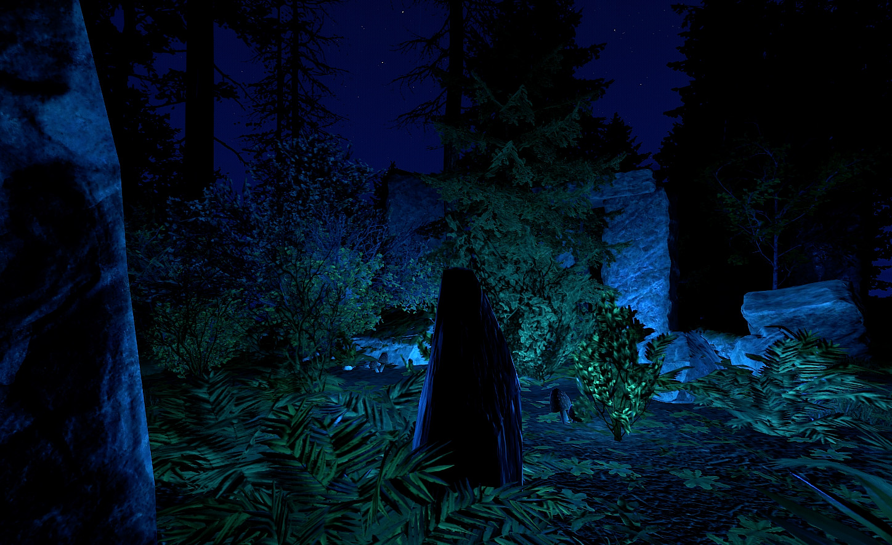

# HolyShit

An epic Custom Map for Rust. Instead of a mono-island with a few bays, this map is handcrafted into several larger islands connected by bridges. Many of the known monuments are flooded or under water. The Small Oilrig is in the middle of the central lagoon, the Cargoship passes under three giant bridges between the islands. This map is navigable by boat and car as well. 

## Screenshots

## Map Layout

## CargoEgressFix Plugin

Since the CargoShip path leads through the map in between islands [a custom plugin is provided](./CargoEgressFix.cs) to prevent the CargoShip from climming through the terrain on egress. 

## Trains Config

For owners of the [Trains Plugin](https://www.chaoscode.io/resources/trains.162/) by [Colon Blow](https://twitter.com/colonblow1) a [configuration file for the roller coaster ride](./Trains.json) is included.

## Custom Monuments, Credits

* [Rollercoaster](https://github.com/yetzt/rust-rollercoaster)
* [Giant Letters](https://github.com/yetzt/rust-alphabet)
* Rocket Silo
* [Marianas Trench](https://rust-keiroxcustommaps.com/prefabs/) Custom Monument by [Keirox](https://rust-keiroxcustommaps.com)
* [Stone Henge](https://rust-keiroxcustommaps.com/prefabs/) Custom Prefab by [Keirox](https://rust-keiroxcustommaps.com)
* [Bridges](https://lone.design/product/rust-custom-bridge-pack/) by [Lone](https://lone.design/) and [Bxrflip](https://lone.design/vendor/bxrflip/)

## License

[Creative Commons Attribution 4.0](https://creativecommons.org/licenses/by/4.0/), excluding Custom Monuments by third parties. Other licenses may apply. 

## Donations

If you like this map and use it on your server, consider passing me some loot on [PayPal](https://paypal.me/yetzt)

